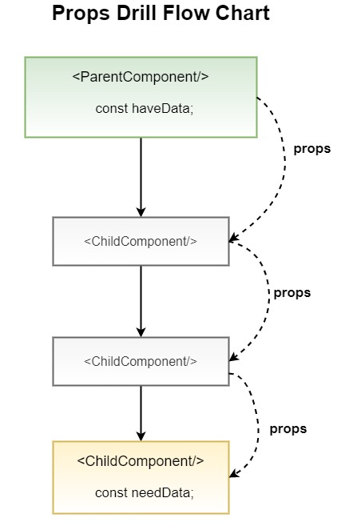

# ReactJS Context API Guide

## Table of Contents

1. [Introduction](#introduction)
1. [Steps to use Context API](#steps-to-use-context-api)


## Introduction

Context API is a mechanism for managing state. It allows you to transfer data across the component tree without having to manually feed data down each level. It prevents props from driling.


**Props Drilling:**

It occurs when the data of the parent component is supplied to each of the nested child components because the last child requires that data.
It can result in needless data transfer, regardless of whether the nested component is required.




## Steps to use Context API

**1. Create context**

React.createContext is used to create context which return two object with  Provider and Consumer.


```javascript
import { createContext } from "react";

export const Context = createContext();
```

**2. Context Provider**

Context Provider keeps the data that is used or needed by the childern components.
It is placed in parent component.

```javascript
<Context.Provider value={/* context state data*/}>
      {children}
</Context.Provider>
```


**3. Context Consumer**

Context Consumer consumers the data provided by the provider. It basically helps child component to get data or value from provider.

```javascript
function AppChild() {
      const  { data } = useContext(Context);

      return (
            <section>
                  <p>Context state value: {data}</p>
            </section>
      )
}
```
